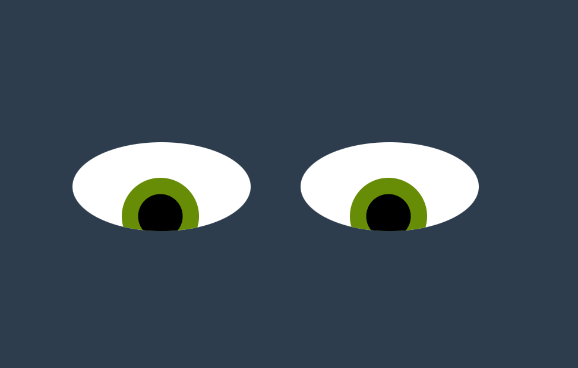
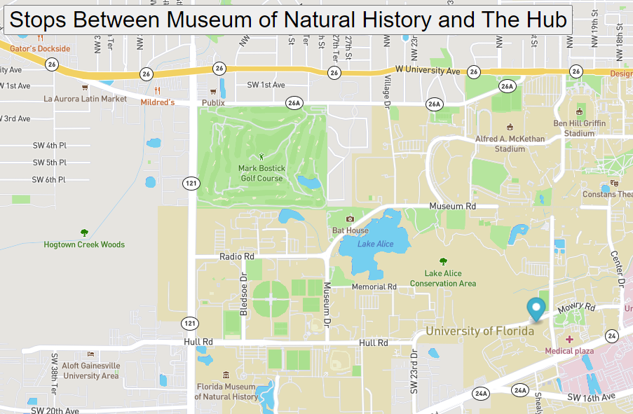

# Coding Projects

## I have created four coding projects completed in the MITx PRO Women in Coding program. Learn about each project below. You can also navigate to the drop down menu on my main page to visit each repository or visit the four cards on my main page to see how each project works.

# Pac-Man Factory
## How to Run:
Download all of the files onto your computer. Drag the index.html file into your browser. Click "Add Pacman" for each Pacman you would like to add. Click "Start Game" to watch them move around your screen.

## Future Improvements:
Create Pac-man of varying colors; Add other Pac-man related elements, like ghosts and cherries; Make the Pac-Men change direction when they hit an edge

# Eye Movement

# Real Time Bus Tracker

# Towers of Hanoi

